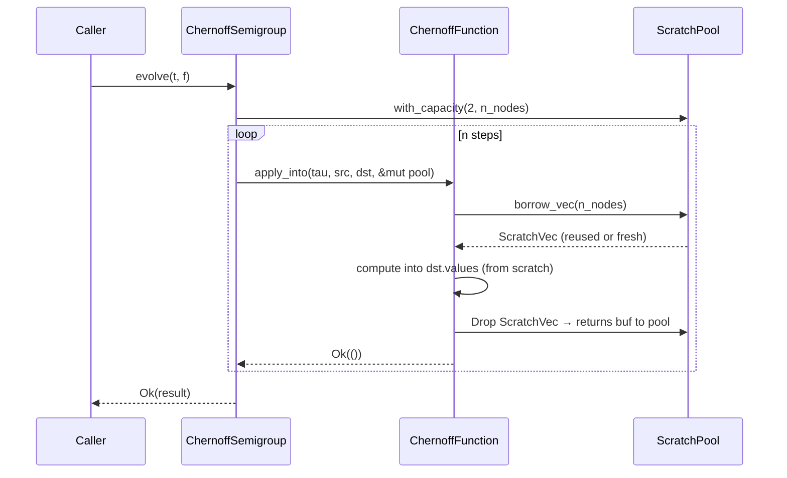

# Wave 1 Contract: Scratch Arena & `apply_into`

**Status**: NORMATIVE
**ADR**: docs/adr/0041-scratch-arena-and-apply-into.md
**Scope**: semiflow-core v2.0 Wave 1

## 1. Type Signatures

### `scratch.rs`

```rust
pub struct ScratchPool<F: SemiflowFloat> {
    free: Vec<Vec<F>>,
    high_water_capacity: usize,
}

impl<F: SemiflowFloat> ScratchPool<F> {
    pub fn new() -> Self;
    pub fn with_capacity(count: usize, cap: usize) -> Self;
    pub fn borrow_vec<'a>(&'a mut self, len: usize) -> ScratchVec<'a, F>;
}

pub struct ScratchVec<'a, F: SemiflowFloat> {
    buf: Vec<F>,
    pool: &'a mut ScratchPool<F>,
}

impl<F: SemiflowFloat> core::ops::Deref for ScratchVec<'_, F> -> &[F]
impl<F: SemiflowFloat> core::ops::DerefMut for ScratchVec<'_, F> -> &mut [F]
impl<F: SemiflowFloat> Drop for ScratchVec<'_, F> {
    // buf.clear(); pool.free.push(buf);  — capacity preserved, length zeroed
}
```

### `chernoff.rs` — additive trait method on `ChernoffFunction<F>`

```rust
fn apply_into(
    &self,
    tau: F,
    src: &Self::S,
    dst: &mut Self::S,
    scratch: &mut ScratchPool<F>,
) -> Result<(), SemiflowError> {
    // Default bridge — backward compatible, allocates once via apply:
    let _ = scratch;
    *dst = self.apply(tau, src)?;
    Ok(())
}
```

## 2. Pool Capacity Policy

- Grow-only: pool never shrinks `high_water_capacity` during use.
- No zero-fill on borrow: caller is responsible for overwriting all returned slots.
- Smallest-fits-first selection: borrow scans `free` for the first `Vec` with
  `capacity >= len`; on miss, allocates fresh.
- No shrink on Drop: `ScratchVec::drop` calls `buf.clear()` (sets len=0) then
  pushes buf back; capacity is preserved.
- `Send + !Sync`: `ScratchPool` is `Send` (can move across threads), not `Sync`
  (single-threaded use only; enforced by `&mut` borrow requirement).

## 3. Aliasing Rules

`borrow_vec` requires `&'a mut ScratchPool<F>`. The borrow checker statically
prevents two live `ScratchVec` handles referencing the same pool simultaneously.
No `RefCell`, no `unsafe`.

## 4. Kernel Migration Table

| Kernel | File | Wave 1 disposition |
|--------|------|--------------------|
| `DiffusionChernoff<f64>` | diffusion.rs | **Override** — `parallel_eval_into` |
| `Diffusion4thChernoff<f64>` | diffusion4.rs | **Override** — `parallel_eval_into` |
| `Diffusion6thChernoff<f64>` | diffusion6.rs | **Override** — `parallel_eval_into` |
| `TruncatedExpDiffusionChernoff<f64>` | truncated_exp.rs | **Override** — g-grid + output from scratch |
| `TruncatedExp4thDiffusionChernoff<f64>` | truncated_exp4.rs | **Override** — g-grid + output from scratch |
| `TruncatedExp4WithCache` | truncated_exp4_cached.rs | **Override** — output from scratch, cache reused |
| `NonSeparable2DChernoff` (parallel) | nonseparable2d.rs | **Override** — 5-leg ping-pong on scratch 2D bufs |
| All `f32` variants | various | **Default bridge** (Wave 5 lifts) |
| `ShiftChernoff1D` | shift1d.rs | **Default bridge** |
| `DriftReactionChernoff` | drift_reaction.rs | **Default bridge** |
| `StrangSplit`, `Strang2D`, `Strang3D` | composition types | **Default bridge** (W2 lifts) |
| `AxisLift`, `AxisLift3D` | axis.rs | **Default bridge** |
| `AdaptivePI` | adaptive.rs | **Default bridge** (W4 lifts) |

## 5. `parallel_eval_into` Refactor

`parallel1d.rs` adds:

```rust
pub(crate) fn parallel_eval_into<E>(
    out: &mut [f64],
    eval: E,
) -> Result<(), SemiflowError>
where
    E: Fn(usize) -> Result<f64, SemiflowError> + Sync;
```

Existing `parallel_eval` becomes a 1-line wrapper:

```rust
pub(crate) fn parallel_eval<E>(n: usize, eval: E) -> Result<Vec<f64>, SemiflowError>
where
    E: Fn(usize) -> Result<f64, SemiflowError> + Sync,
{
    let mut out = vec![0.0_f64; n];
    parallel_eval_into(&mut out, eval)?;
    Ok(out)
}
```

## 6. `ChernoffSemigroup::evolve` Ping-Pong Rewrite

```rust
pub fn evolve(&self, t: f64, f: &S) -> Result<S, SemiflowError> {
    if !t.is_finite() || t < 0.0 {
        return Err(SemiflowError::DomainViolation {
            what: "t must be finite and >= 0",
            value: t,
        });
    }
    let tau = t / self.n as f64;
    let n_nodes = /* estimated from f */ f.zeroed_like(); // placeholder
    let mut buf_a: S = f.clone();
    let mut buf_b: S = f.zeroed_like();
    let mut scratch: ScratchPool<f64> = ScratchPool::with_capacity(2, n_nodes);
    let mut src_is_a = true;
    for _ in 0..self.n {
        if src_is_a {
            self.func.apply_into(tau, &buf_a, &mut buf_b, &mut scratch)?;
        } else {
            self.func.apply_into(tau, &buf_b, &mut buf_a, &mut scratch)?;
        }
        src_is_a = !src_is_a;
    }
    Ok(if src_is_a { buf_a } else { buf_b })
}
```

## 7. Capability Map

- No new capabilities required (additive MINOR change, ADR-0035).
- `ScratchPool` / `ScratchVec` are `pub` types in `semiflow-core` — no JWT/scope gates.
- `apply_into` is a new trait method with default impl — no breaking change.

## 8. Message-Flow Diagram



## 9. Out-of-Scope Denials (Wave 1)

- Per-thread parallel pools: **NO** (W2)
- Strang2D/3D pencil ping-pong: **NO** (W2)
- State<F> trait split (zeroed_like → separate ZeroedState bound): **NO** (W3)
- AdaptivePI scratch: **NO** (W4)
- FFI/PyO3/WASM zero-copy: **NO** (W5)
- `apply_into` for `f32` kernels: **NO** (W5, default bridge is correct)
- WASM `alloc`-less path: **NO** (W5)
